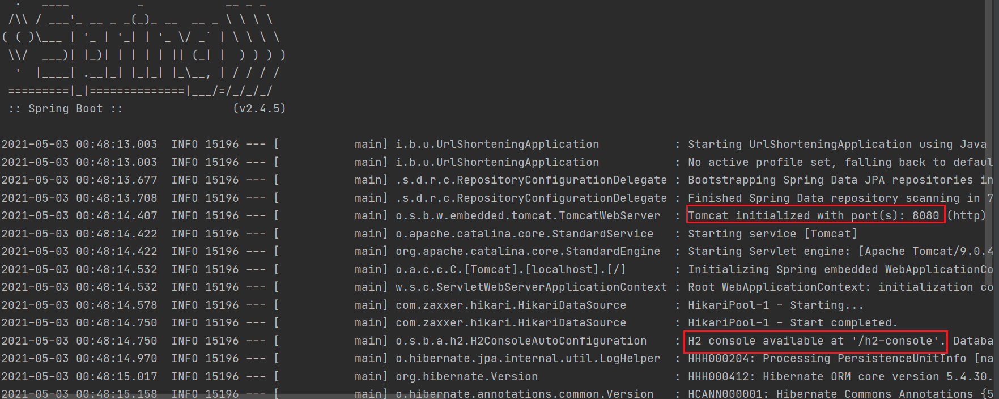

= url-shortening-microservice

== URL Shortening Microservice in Java Spring Boot

== Developed By https://beagarwal.com[Shubham Agarwal]

=== Requirements:

* Java 1.8
* Spring 2.4.5
* H2 Database

=== Dependencies:
[source, xml]
----
<dependency>
    <groupId>org.springframework.boot</groupId>
    <artifactId>spring-boot-starter-web</artifactId>
</dependency>

<dependency>
    <groupId>org.springframework.boot</groupId>
    <artifactId>spring-boot-starter-data-jpa</artifactId>
</dependency>

<dependency>
    <groupId>com.h2database</groupId>
    <artifactId>h2</artifactId>
    <scope>runtime</scope>
</dependency>

<dependency>
    <groupId>com.google.guava</groupId>
    <artifactId>guava</artifactId>
    <version>20.0</version>
</dependency>

<dependency>
    <groupId>org.apache.commons</groupId>
    <artifactId>commons-lang3</artifactId>
    <version>3.0</version>
</dependency>
----

=== Steps for running in local machine

    * Fork this repo.
    * Or clone this repo into your local by following link:

        git clone git@github.com:BeAgarwal/url-shortening-microservice.git

    * Make sure you have all dependencies installed which are used in this project.
    * After that, Run your application.
    * While running, you should get these following logs in your terminal:

    * If not, add these properties in your ``application.properties``

        spring.h2.console.enabled=true
        spring.h2.console.path=/h2-console

    * A

